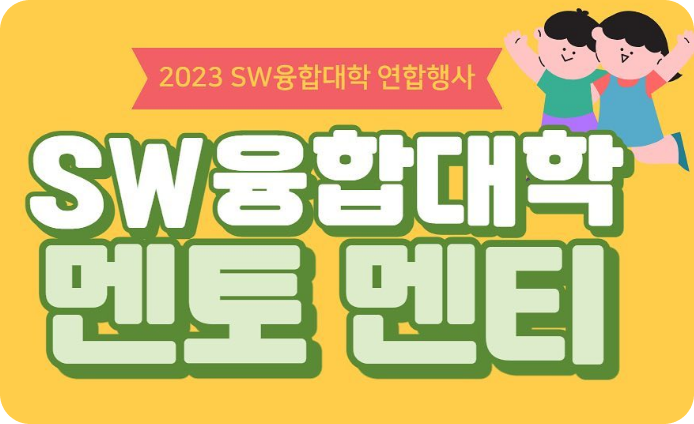
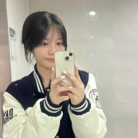
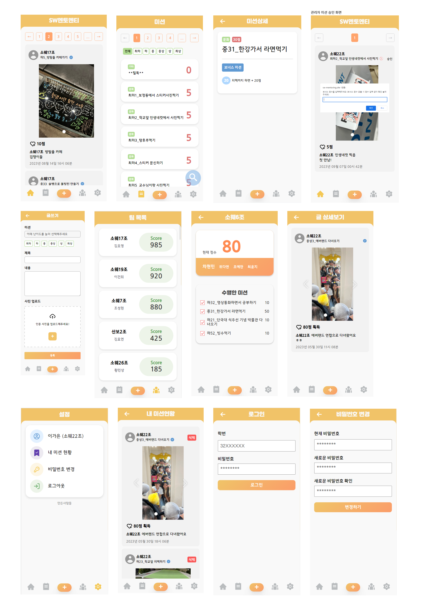

# 
2023 단국대학교 SW융합대학 멘토멘티 미션 인증 사이트

 

우리과 선후배 · 동기가 한 조가 되어 미션을 수행하는 '멘토멘티' 행사를 위해 제작된 미션 인증 사이트

 

  

## 🔗 배포 주소

http://sw-mentoring.site

(23.09 서버 종료 예정😿)

  

## 🧑‍💻 팀원 소개

|                        FE                         |                        BE                         |                        BE                         |
| :-----------------------------------------------: | :-----------------------------------------------: | :-----------------------------------------------: |
|  |  |  |
|    이가은 (@[gaeunnlee](github.com/gaeunnlee))    | 최재민 (@[dku19jam](https://github.com/dku19jam)) | 차현민 (@[gutanbug](https://github.com/gutanbug)) |

  

## 💭 프로젝트 소개

매년 소프트웨어학과에서 진행되었던 멘토멘티 행사는 카카오톡 그룹채팅방을 통해 미션 사진을 올리고, 직접 점수를 집계해야 했으며, 그룹채팅방에 조장만 속해 있어 모두가 미션 진행 상황을 볼 수 없었습니다. 또한 올해 행사의 규모가 SW융합대학으로 확장되면서 행사가 효율적으로 진행되어야 할 방안이 필요했습니다. 이러한 점들을 개선하고자 모두가 열람할 수 있고, 추억을 기록할 수 있는 멘토 멘티 미션 인증 사이트를 제작하게 되었습니다.

  

## 📚 STACKS

 
 

      
 
 
 
      

    

  

## 🖥️ 화면 구성

  

## 📄 주요 기능

- MAIN
  - 미션 인증 글 조회
  - 이미지 슬라이드 적용
- TEAM
  - 조 목록 조회
  - 조 상세 조회
    - 해당 조가 올린 등록글 조회
- MISSION
  - 미션 리스트 조회
  - 미션 상세 조회
  - 미션 검색
- POST
  - 미션 조회 후 선택
  - 사진 업로드 (복수)
- SETTING
  - 내 미션
    - 내가 올린 미션 조회
    - 내가 올린 미션 삭제
  - 비밀번호 변경
- ADMIN
  - 관리자 계정 접속시 점수 부여